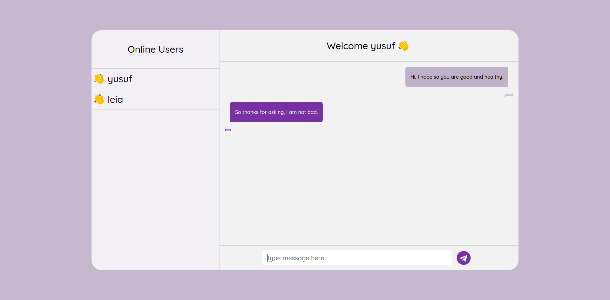
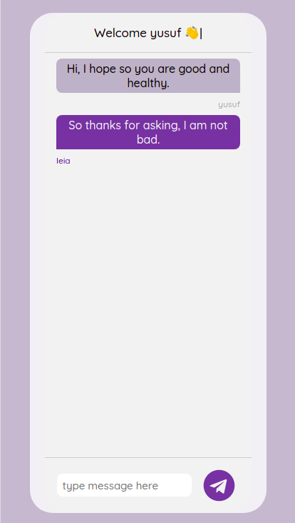

# Chat App
You can talk with  online users,
see all online users & enjoy chatting.

#Preview
## Website Preview

## Mobile Preview


### Used Technologies
```React, Styled-Components, Nodejs, Express, Socketio```
### Deployment
```backend : heroku```
```backend : netlify```

### Thanks
I was inspired: https://dribbble.com/shots/12765133-Chat-Dashboard-Amphi
